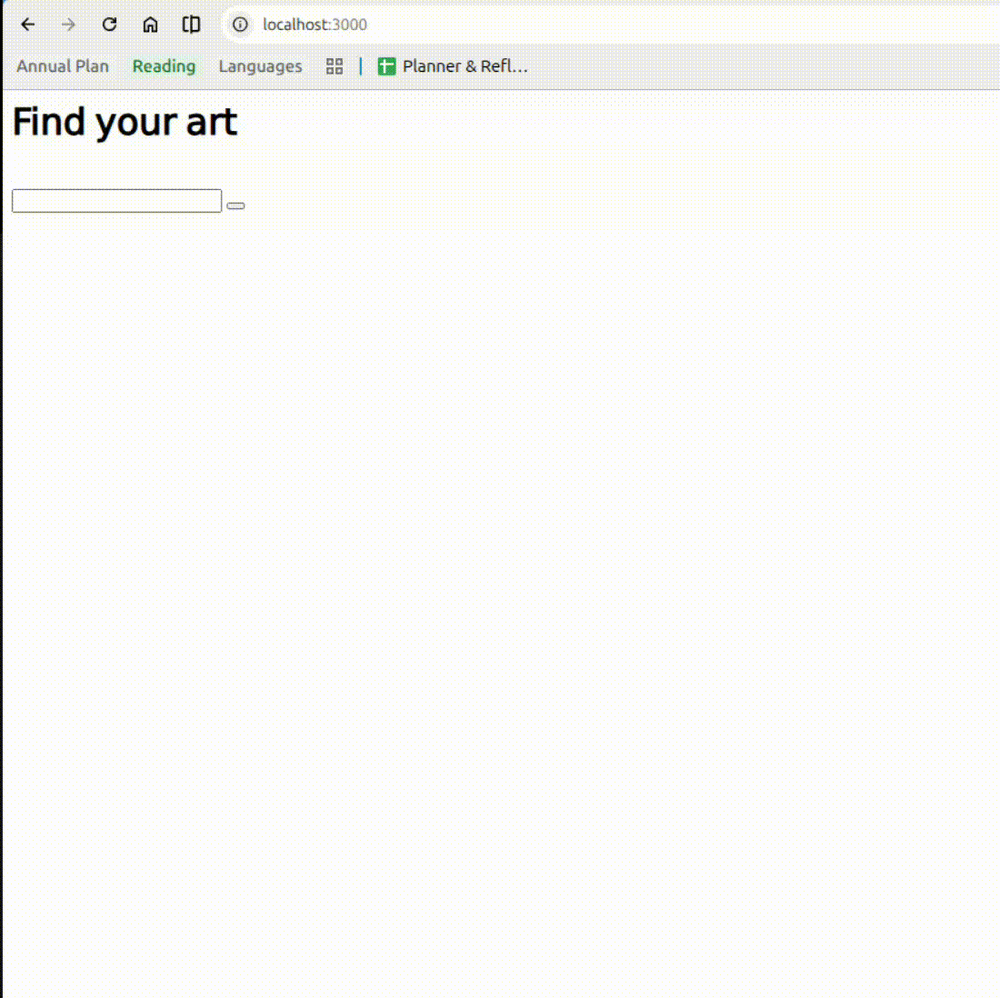

This is a random painting API. 

The API calls The Met museum's collection api and returns an image based on your search term. 

``/search`` takes a search term in form of the query parameter ``"q":string`` and returns the first image returned by the Met.
``/img`` takes the Met's id for an image in form of query parameter ``imageId:int`` and returns the imageObject returned by the Met.

</img>